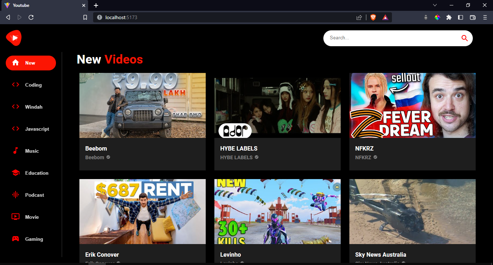

# Youtube Clone - Frontend

`Stack :  Vite, TypeScript, React, Material UI`

`Backend :
https://rapidapi.com/ytdlfree/api/youtube-v31`

`if the video doesn't appear or has an error, because the limit of the RapidAPI is a maximum of 500 requests per day`

# 
